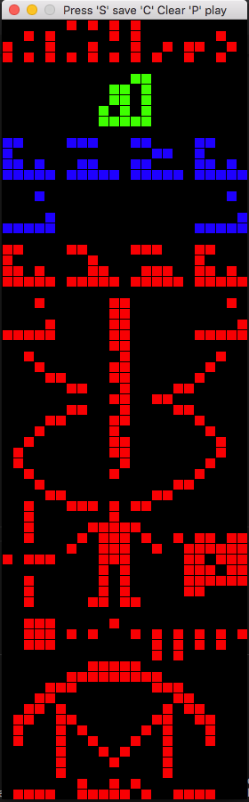
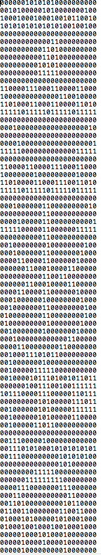

Do you want to create your own Binary Message to Send to Aliens in Space?

This graphic  editor will let you visually create a  binary message (010111) 
In the same format at the original  Arecibo Message sent from the Arecibo Observatory in 1974. 

Made with Python and PyGame. 

### How to Run

Requires python 2.65 or later

Runing:  

>  python alien.py 

### How to use The Editor

Click on a cell to change its color (sets it to 1 or resets it to 0) 

Press the following keys. 

C - Clears the editor so you can draw your own message

P - Play the file from top to bottom  ( beeps the 1s)

S - Saves the file to  "new_message.txt" 

### Editor

### Output - new_message.txt

  

i
